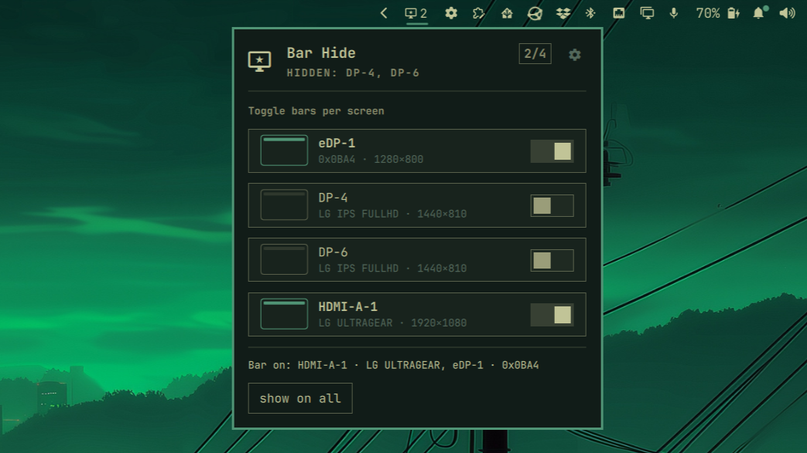

# Bar Hide



Hide the Omarchy top bar per monitor — pick which screens show the bar
through a picker in the bar itself. In a multi-monitor setup you pin the
bar to one monitor or several; unselected screens get no bar, and with
nothing selected the native bar-on-every-screen behavior applies.
Selection is live and happens inside the bar — no config edits needed —
and every other bar widget keeps working as-is.

## Why hide the bar per monitor?

Bar space is precious on mixed screen sizes — a TV or projector that only
shows video does not need a bar, while your main display does. Bar Hide
gives you per-screen bar control straight from the native bar: hide it on
some monitors, show it on others, or leave it everywhere. It is the
multi-monitor answer to Omarchy's single bar-hidden toggle, which affects
all screens at once.

Built for Omarchy 4 (Quattro). Bar Hide is an ordinary bar-widget plugin: it
does not replace the native bar. Every picker instance lives inside its
screen's bar panel and parks that panel when the screen is not selected —
the same mechanism the native bar-hidden toggle uses. Widgets, layout,
theming and popouts stay Omarchy-owned.

## Install

```sh
omarchy plugin add https://github.com/wynout/omarchy-barhide.git --enable
omarchy plugin enable wynout.barhide --section right
omarchy restart shell
```

Enabling places the picker widget in the bar's right section. (The plugin is
not a bar replacement, so no `omarchy bar use` is needed.)

## Usage

Click the picker icon in the bar to open the screen list. Each connected
screen gets a **show** / **hide** toggle:

- With screens selected, **show** adds a screen to the bar, **hide** removes
  it, and **show on all** clears the selection so the bar covers everything.
- In that all-screens state every row reads **hide** — hiding one screen
  pins the bar to the remaining connected screens.

Screens you showed that are currently disconnected stay in the list (their
bar returns when they do) and show up in a "not connected" section with a
**forget** button.

Settings persist in Bar Hide's own entry in `bar.layout` inside
`~/.config/omarchy/shell.json`:

```json
{
  "id": "wynout.barhide",
  "monitors": [
    { "name": "HDMI-A-1", "model": "LG ULTRAGEAR", "serial": "123abc456" }
  ]
}
```

Config written by older versions (`primary`/`secondary` keys) keeps working;
the picker rewrites it in the new shape on its next save.

Matching scores every connected screen against the stored reference —
name +2, serial +1, model +1 — and the single highest-scoring screen wins.
A genuine tie (reference cannot tell two screens apart) refuses to guess.

A hand-edit override lives under `bar.barhide` in shell.json and takes
precedence over the widget's own entry:

```json
"bar": {
  "barhide": {
    "monitors": ["ultragear", "eDP-1"],
    "showCountBadge": false
  }
}
```

Options share the entry shape. `showCountBadge` (default `true`): whether
the picker icon in the bar carries the selected-screens count. `pickerGlyph`
replaces the picker icon itself (default md-monitor-star; choose from the
options page, which offers a few monitor-themed Nerd Font glyphs). Toggle/
choose from the popup — the cog in the panel hero opens a small options
page, and the choice persists in the widget's own entry. The override takes
both options too.

List entries can be plain strings (case-insensitive substring of model or
name) or full `{ name, model, serial }` references.

## How it works

Each picker instance resolves its selection from the live shell.json and
parks its own host panel when that screen is not selected: a negative margin
past the active edge plus `ExclusionMode.Ignore`, the mechanism the native
bar-hidden toggle uses. Parking includes the global `omarchy toggle bar off`
flag, so that toggle keeps working on top of Bar Hide. All pickers share one
state object (`singles/BarHideState.qml`): a single shell.json watcher, one
bar-off probe (re-probed on a 15s fallback timer, since the directory watch
can go quiet after rapid flag changes), and one resolved selection — so
screens cannot disagree about park state. Parking decisions wait until the
config file has been read once; at startup the native bar-on-every-screen
behavior applies until then.

The selection write goes through the widget's own `updateEntryInline`, the
same write path the built-in clock uses for its format cycling.

See `AGENTS.md` for the design investigation, the trade-offs, and the
naming history (shipped v0.2–0.3 as `monobar`, when it still replaced the
whole bar).

## Remove

```sh
omarchy plugin remove wynout.barhide
```

## Development

```sh
PLUGIN_DIR=~/.config/omarchy/plugins/wynout.barhide
omarchy plugin validate "$PLUGIN_DIR"
qmllint -I "$OMARCHY_PATH/shell" "$PLUGIN_DIR/Picker.qml" "$PLUGIN_DIR/Panel.qml"
```

Note: the shell caches plugin QML components; file edits only hot-reload the
registry, so run `omarchy restart shell` to load changed code.
